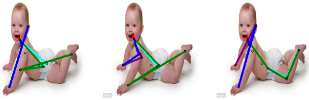
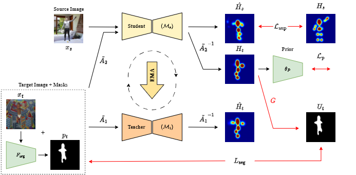

# [Leveraging Synthetic Adult Datasets for Unsupervised Infant Pose Estimation, CVPR 2025](https://openaccess.thecvf.com/content/CVPR2025W/ABAW/html/Bose_Leveraging_Synthetic_Adult_Datasets_for_Unsupervised_Infant_Pose_Estimation_CVPRW_2025_paper.html)

Code for [Leveraging Synthetic Adult Datasets for Unsupervised Infant Pose Estimation, CVPR 2025](https://openaccess.thecvf.com/content/CVPR2025W/ABAW/html/Bose_Leveraging_Synthetic_Adult_Datasets_for_Unsupervised_Infant_Pose_Estimation_CVPRW_2025_paper.html)

[Sarosij Bose](https://sarosijbose.github.io/), [Hannah Dela Cruz](https://sites.google.com/view/hannah-dela-cruz-a-portfolio/hannah-dela-cruz-a-portfolio?authuser=0), [Arindam Dutta](https://vcg.ece.ucr.edu/people/arindam-dutta-0), [Elena Kokkoni](https://profiles.ucr.edu/elena.kokkoni), [Konstantinos Karydis](https://profiles.ucr.edu/konstantinos.karydis), and [Amit Kumar Roy Chowdhury](https://vcg.engr.ucr.edu/amit)

# Introduction

<p align="left">
  
</p>

From left to right: keypoint predictions from a baseline adult human pose estimation model ([Xiao et al., 2018](https://arxiv.org/abs/1807.10221)), predictions from a SOTA UDA pose estimation model ([Kim et al., 2022](https://arxiv.org/abs/2204.00172)), and predictions from our method, SHIFT. Adult pose estimation models fail when directly applied to infant data; similarly, UDAPE struggles to overcome the domain shift between adults and infants. In contrast, SHIFT accounts for the highly self-occluded pose distribution of infants, thereby effectively adapting to the infant domain

# Method

<p align="left">
  
</p>

SHIFT leverages the mean-teacher framework ([Tarvainen et al., 2017](https://arxiv.org/abs/1703.01780)) to adapt a model pretrained on a labeled adult source dataset $(x_s, y_s)$ to unlabeled infant target images $(x_t)$. To address anatomical variations, SHIFT employs an infant pose prior $\theta_p$ to produce plausibility scores for each prediction of the student model $\mathcal{M}_s$ and, to handle self-occlusions we employ an off-the-model $F_{seg}$ and our learned Kp2Seg module $(G)$ to perform image-pose visibility alignment

**Bibtex**
```
@InProceedings{Bose_2025_CVPR,
                author    = {Bose, Sarosij and Cruz, Hannah Dela and Dutta, Arindam and Kokkoni, Elena and Karydis, Konstantinos and Chowdhury, Amit Kumar Roy},
                title     = {Leveraging Synthetic Adult Datasets for Unsupervised Infant Pose Estimation},
                booktitle = {Proceedings of the Computer Vision and Pattern Recognition Conference (CVPR) Workshops},
                month     = {June},
                year      = {2025},
                pages     = {5562-5571}
            }
            }
```

# Usage

**Dataset Preparation**

**SURREAL Dataset**
As instructed by [UDA_PoseEstimation](https://github.com/VisionLearningGroup/UDA_PoseEstimation/tree/master), the following datasets can be downloaded automatically:
- [Surreal Dataset](https://www.di.ens.fr/willow/research/surreal/data/)
- [SyRIP Dataset](https://coe.northeastern.edu/Research/AClab/SyRIP/images/)
- [MINI-RGBD Dataset](https://www.iosb.fraunhofer.de/en/competences/image-exploitation/object-recognition/sensor-networks/motion-analysis.html#mini-rgbd)

Save it to `../MINI-RGBD_web`

**Prior Module Training**

See `prior` folder for instructions.

**Keypoint-to-Segmentation Module Training**

```python train_keypoint_to_segmentation.py --dset-root path/to/surreal --dset SURREAL --arch pose_resnet101 --image-size 256 --heatmap-size 64 --batch-size 32 --log path/to/log/directory --lr 0.0003 --workers 2 --seg-threshold 0.5 --iters-per-epoch 500 --epochs 30 --seed 0 --print-freq 100 --save-dir path/to/save/directory```

# Experiments

SURREAL-to-MINIRGBD

```python train_human_to_infant.py path/to/surreal path/to/mini-rgbd -s SURREAL -t MiniRGBD --target-train MiniRGBD_mt --log logs/surreal2minirgbd --prior path/to/prior_stage_3.pt --kp2seg /path/to/kp2seg_data/SURREAL_kp2seg_gan.pt --debug --lambda_c 1 --pretrain-epoch 40 --lambda_s 1e-6 --lambda_p 1e-6 --mode 'all' --rotation_stu 60 --shear_stu -30 30 --translate_stu 0.05 0.05 --scale_stu 0.6 1.3 --color_stu 0.25 --blur_stu 0 --rotation_tea 60 --shear_tea -30 30 --translate_tea 0.05 0.05 --scale_tea 0.6 1.3 --color_tea 0.25 --blur_tea 0 -b 32 --mask-ratio 0.5 --k 1 --s2t-freq 0.5 --s2t-alpha 0 1 --t2s-freq 0.5 --t2s-alpha 0 1 --occlude-rate 0.5 --occlude-thresh 0.9```

SURREAL-to-SyRIP

```# python train_human_to_infant.py path/to/surreal path/to/SyRIP/data/syrip/images -s SURREAL -t SyRIP --target-train SyRIP_mt --log logs/surreal2syrip --prior path/to/prior_stage_3.pt --kp2seg /path/to/kp2seg_data/SURREAL_kp2seg_gan.pt --debug --lambda_c 1 --pretrain-epoch 40 --lambda_s 1e-6 --lambda_p 1e-6 --mode 'all' --rotation_stu 60 --shear_stu -30 30 --translate_stu 0.05 0.05 --scale_stu 0.6 1.3 --color_stu 0.25 --blur_stu 0 --rotation_tea 60 --shear_tea -30 30 --translate_tea 0.05 0.05 --scale_tea 0.6 1.3 --color_tea 0.25 --blur_tea 0 -b 32 --mask-ratio 0.5 --k 1 --s2t-freq 0.5 --s2t-alpha 0 1 --t2s-freq 0.5 --t2s-alpha 0 1 --occlude-rate 0.5 --occlude-thresh 0.9```
<!-- # Acknowledgements -->

